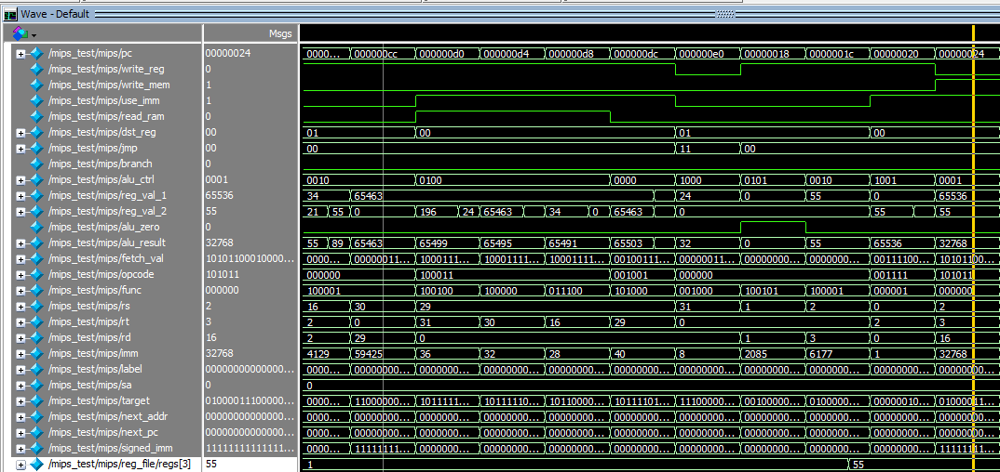
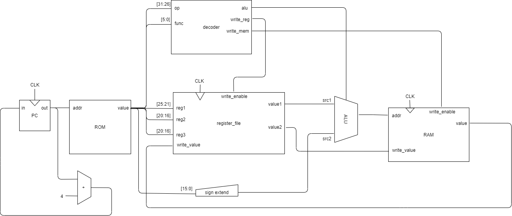

# MIPS on FPGA

MIPS architecture processor on Intel FPGA for learning.



*runs on modelsim.

## Logic circuit



## Implemeneted instructions

|name|desc|
|-|-|
|addiu|rt = rs + imm|
|addu|rd = rs + rt;|
|bne|if (rs != rt) pc += offset * 4|
|j|pc = pc_upper \| (target << 2)|
|jal|r31 = pc; pc = target << 2|
|or|rd = rs \| rt|
|jr|pc = rs|
|lw|rt = \*(int\*)(offset + rs)|
|sw|\*(int\*)(offset + rs) = rt|
|lui|rt = imm << 16|


## Test code

code below calculates a fibonacci number.

```c
int fib(int n);

int main()
{
    int a = fib(10);
}

int fib(int n)
{
    if (n == 0) return 0;
    if (n == 1) return 1;
    return fib(n - 1) + fib(n - 2);
}
```

into assembly

```asm
addiu       sp,sp,-32
sw          ra,28(sp)
sw          s8,24(sp)
move (addu) s8,sp
li (addiu)  a0,10
jal         0x44
move (or)   at,at
move (addu) v1,v0
lui         v0,0x1
sw          v1,-32768(v0)
move (addu) v0,zero
move (addu) sp,s8
lw          ra,28(sp)
lw          s8,24(sp)
addiu       sp,sp,32
jr          ra
move (or)   at,at

addiu       sp,sp,-40
sw          ra,36(sp)
sw          s8,32(sp)
sw          s0,28(sp)
move (addu) s8,sp
sw          a0,40(s8)
lw          v0,40(s8)
move (or)   at,at
bnez (bne)  v0,0x78
move        at,at
move        v0,zero
j           0xcc
move        at,at
lw          v1,40(s8)
li (addiu)  v0,1
bne         v1,v0,0x94
move        at,at
li(addiu)   v0,1
j           0xcc
move        at,at
lw          v0,40(s8)
move        at,at
addiu       v0,v0,-1
move        a0,v0
jal         0x44
move        at,at
move        s0,v0
lw          v0,40(s8)
move        at,at
addiu       v0,v0,-2
move        a0,v0
jal         0x44
move        at,at
addu        v0,s0,v0
move        sp,s8
lw          ra,36(sp)
lw          s8,32(sp)
lw          s0,28(sp)
addiu       sp,sp,40
jr          ra
move        at,at
move        at,at
move        at,at
```

## Refs

- [registers](https://opencores.org/projects/plasma/opcodes#compiler-register-usage)
- [opcodes](https://opencores.org/projects/plasma/opcodes#opcodes)
- instruction format
    - [type R](https://www.d.umn.edu/~gshute/mips/rtype.xhtml)
    - [type I](https://www.d.umn.edu/~gshute/mips/itype.xhtml)
    - [type J](https://www.d.umn.edu/~gshute/mips/jtype.xhtml)
